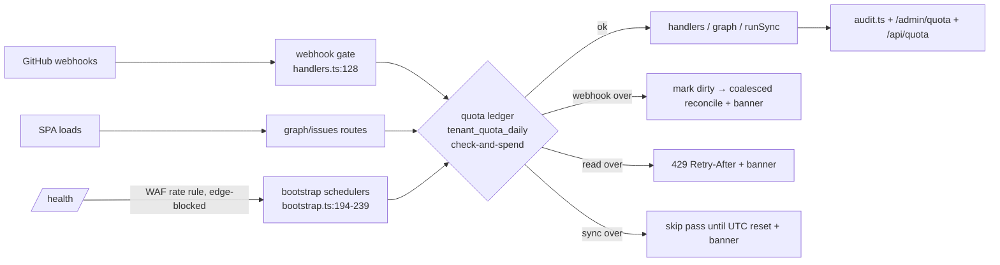

## Source

Issue #295. Operator (2026-07-02, FR, condensed): *"Un utilisateur qui a beaucoup
d'issues, beaucoup de mises à jour, beaucoup de webhooks, ça nous fait péter
notre consommation de compute sur notre forfait gratuit Cloudflare. Je veux un
système qui bride ça — définir ce qui consomme, quoi limiter, quelle stratégie
(par jour, par mois). Plus tard la limite sera levée par un tier payant."*

## Problem

All caps in the codebase are **global** (`WINDOW=20`, `MAX_PAGES=500`,
`NUM_SLOTS=2` — `sync/constants.ts:5-21`; sync lock + auth-halt breaker —
`sync/control.ts:55-129`). Nothing is **per-tenant**, and there is no
plan/tier column anywhere (`tenants` has only id/installation/login/suspended/
deleted — `migrations/0004`). One noisy tenant spends shared account-wide
daily budgets, and the D1 fail mode is a **hard account-wide outage**, not a
slowdown: "When your account hits the daily read and/or write limits, you will
not be able to run queries against D1" — every tenant's app goes dark and
webhook payloads are dropped (handler catch returns `200 {ok,error}` —
`webhook/handlers.ts:170-173` — GitHub never retries).

### Verified free-plan limits (all reset 00:00 UTC; adversarially confirmed 2026-07-02)

| Limit | Free plan | Fail mode |
|---|---|---|
| Worker requests | 100k/day account-wide (cron counts; service-binding hops do **not**; static assets & WAF-blocked requests do **not**) | Error 1027, fail open/closed per route |
| Worker CPU | 10 ms/invocation | terminated on consistent overrun |
| Subrequests | **50/invocation** (any `fetch`; D1 calls have own 50-queries/invocation cap) | invocation error |
| D1 reads | 5M **rows scanned**/day | hard fail, all queries error |
| D1 writes | 100k rows/day | hard fail |
| Workers Logs | 200k events/day, 3-day retention — and `wrangler.toml:40` runs `head_sampling_rate=1` today | drop/sample |
| Queues | free: 10k ops/day (~3.3k msgs) | ops fail |
| DO (SQLite) | free: 100k req/day, 5M reads/100k writes/day (own pool, separate from Worker requests) | ops fail |
| WAF rate rule | 1 rule **per zone** (`roxabi.dev` — shared with every property on the zone), path-match, per-IP, 10s window; blocks **before** the Worker | n/a |
| Workers ratelimit binding | GA, free, `{limit, period:10\|60}`, **per-colo**, eventually consistent | n/a |

Fail-mode caveats (ops): the fail open/closed toggle exists **only** for the
Worker request cap — D1 has no toggle, it always hard-fails. "Fail open" on a
Worker-only custom domain (no origin behind `api.live.roxabi.dev`) is
unverified and likely a 522 — test before treating it as a safety net. For
`/webhook` the only safe posture is always-200 + coalesce: GitHub never
retries and auto-disables hooks after sustained delivery failures.

### Cost model — what actually consumes (workflow-profiled, file:line verified)

| Path | Trigger | Cost | Amplification |
|---|---|---|---|
| `GET /api/graph` | SPA mount, every `data_version` bump (detected by 15s `/api/version` poll), refocus | **25-40k rows read/request** @5k issues — the issues SELECT (JSON payload parsed per row), labels + edges `IN(SELECT key FROM issues…)` subqueries each rescanning the corpus, and a `GROUP BY repo` count = 3-5 corpus scans (`api/graph.ts:147-279`); D1 bills rows **scanned**, not returned. No ETag/304/Cache-Control anywhere | **1 active user @5k issues ≈ 5-6M rows read/day realistic; 55-60M worst → binds FIRST** |
| Webhook `delete` (branch) | each branch deletion | full-repo branch re-scan (≤500 GraphQL pages, `repo-branches.ts:87`) + reset UPDATE touching **all repo issue rows** (`repo-branches.ts:37`) | 100-branch prune = 100 full re-scans, zero coalescing |
| Webhook fan-out | bulk actions | 500 bulk-closed issues = 500 deliveries ≈ 2000 D1 calls + 500 redundant `data_version` bumps; no dedup (`X-GitHub-Delivery` never read) | writes budget |
| Install bootstrap | SPA polls `/api/sync/status` | 50-repo/5k-issue org: **45-60k rows written** (½ of daily budget), ~2 700 subrequests — discovery probes are **quadratic** (2×(50+49+…+1)=2550, `tenants.ts:30-35`), first pass ~105 subreqs **already exceeds the 50/invocation cap** | one big install ≈ outage risk |
| `GET /api/sync/status` poll | 2s during bootstrap | ~21 D1 stmts/call incl. `getRepoSyncProgress` ×4 + `COUNT(*)` issues full scan (`bootstrap.ts:242-265`) | reads |
| `GET /health` | **unauthenticated** | `COUNT(*)` issues + ~10 stmts + can schedule a sync pass (`router.ts:96-160`) | abusable |
| No-op bumps | tags, dependabot branches, PR/milestone no-ops | 1 D1 write each — `mutated=true` unconditional (`handlers.ts:146-157`) | writes |
| Session auth | every API request | 1 indexed D1 read + 1 read **per private repo** even on perm-cache hit (`auth/repoAccess.ts:159-165`) | reads |

**Binding order:** D1 rows read ≫ D1 rows written ≫ Worker requests ≫ CPU.
The graph endpoint alone is 95%+ of read volume; requests only bind at ~25
concurrent active users. Existing breakers protect against dead credentials
and concurrency, **not volume** — and bootstrap deliberately bypasses +
auto-resumes the halt breaker (`sync.ts:327-330`, `bootstrap.ts:183-188`).

## Outcome

- A tenant generating unbounded webhooks/issues/reads cannot take the shared
  account past free-plan limits: their excess traffic degrades gracefully and
  **visibly** (never silent data loss), while other tenants stay live.
- Budgets are per-tenant, inspectable by the operator **and by the tenant
  themselves**, and tied to a tenant tier so a paid tier later just raises
  numbers per tenant.
- **Daily** period (matches every CF reset at 00:00 UTC). Monthly only as a
  billing wrapper later — no CF limit is monthly except R2/Queues-paid.

## Decisions (operator-validated 2026-07-02)

| Question | Decision |
|---|---|
| Free-tier tenant target | **20 active free clients** — per-tenant daily budgets halved vs the original ~10-tenant sizing |
| Cloudflare plan | **Workers Paid ($5/mo)** already active since 2026-06-05 — risk is **cost overrun**, not hard D1 outage; quotas still required for fairness + future paywall |
| Over-budget behavior | **Defer** (coalesce webhooks, 429 graph with Retry-After, pause sync) — never silent data loss |

## Appetite

F-full (#295, κ=6) sliced S1→S2→S3; S4 paywall deferred.

## Shapes

### Shape 1: Efficiency first + D1 quota ledger (per-tenant daily budgets)

Two prongs, same PR chain:

**(A) Cut structural waste** so budgets are rarely hit (multiplies free-tier
headroom ~10-50× before any throttling):
- ETag/304 on `/api/graph` (`graph.ts:292`) keyed
  `hash(data_version, repoSetHash, userSealVersion, queryParams)` —
  unchanged-corpus refetch = ~1 row read instead of 25-40k. The per-user
  component is **mandatory**: sealing/unsealing ZK titles doesn't bump
  `data_version`, so a tenant-shared ETag would 304 a user into stale
  plaintext titles. Biggest single win — but it only covers the
  *unchanged*-corpus case; a real bump still costs a full rebuild, which the
  `graph_rows` budget below bounds (delta/incremental graph fetch is the
  later lever if telemetry says it's needed).
- `Cache-Control: max-age=10` + ETag on `/api/version` (`version.ts:19-28`).
- Persist `bootstrap_complete` flag → `/api/sync/status` early-return (3 point
  reads vs ~21 stmts); maintained issue counter vs `COUNT(*)`.
- Debounce branch re-scans per repo/time-window (`handlers-ref.ts:78-80`);
  fix unconditional `mutated=true` no-op bumps (`handlers.ts:146-157`).
- Cap discovery probes per pass (kills the quadratic bootstrap,
  `tenants.ts:25-36`); gate `/health` diagnostics behind a cached flag.
- Workers Logs audit: with `head_sampling_rate=1`, per-request logging can
  trip the 200k events/day cap on its own — log run-audit summaries, not
  per-request, or lower sampling on hot routes.

**(B) Per-tenant daily budgets in D1** — new `0023_tenant_quota_daily.sql`:
`(tenant_id, day, metric, used, PK(tenant_id,day,metric))` + `ALTER TABLE
tenants ADD COLUMN plan TEXT NOT NULL DEFAULT 'free'`. Check-and-spend = one
conditional `UPDATE … SET used=used+? WHERE used+? <= ?`; D1 serializes all
writes on a single SQLite writer so the statement is atomic —
`meta.changes=1` ⇒ spend accepted, `0` ⇒ over budget (same idiom as
`acquireSyncLock`, `control.ts:55-67`). Day rollover **seeds the row first**
(`INSERT OR IGNORE … used=0`, idiom `tenants.ts:77-94`) — without the seed
the first request of a fresh day matches nothing and is wrongly denied.
Per-plan limits live in code (`quota/limits.ts`), keyed by `plan`.

Metered + enforced at 3 choke points (each already has tenant id in hand):

| Choke point | Metric | Over-budget behavior |
|---|---|---|
| Webhook tenant gate (`handlers.ts:128-134`; quota read JOINs the mandatory tenant read → +0 D1). S1 metering folds the spend into the existing mutation batch; S3 enforcement runs the gating check **before** the batch | `webhook_events/day`, `gh_fetches/day` | **coalesce, don't drop**: mark repo dirty (`sync_state`), return `200 {ok, deferred}`; dirty repos reconciled by a bootstrap-style pass when budget refreshes |
| Graph/issues routes (`graph.ts:132`, `issues.ts` — **not** the shared `requireLinkedTenant` middleware: `/api/sync/status` uses the same middleware and its 2s bootstrap poll would self-429) | `graph_rows/day` — actual rows from D1 `meta.rows_read`, not request count | `429 Retry-After` + SPA banner; `/api/version` stays cheap so polling survives |
| Bootstrap/sync schedulers (`bootstrap.ts:194-239`, `tenants.ts:96`, `window.ts:35-82`) | `sync_pages/day`, `sync_writes/day` | skip pass; resume next UTC day |

Non-metered paths (explicit): unauthenticated `/health`, and webhooks without
routing context (`hasRoutingContext=false`, `handlers.ts:128`) have no tenant
to bill — covered by prong (A) efficiency + the WAF rule on `/health` only.

**Degradation is tenant-visible in all three states**, not just the 429: a
`GET /api/quota` (same ledger reads as `/admin/quota`) feeds an SPA banner —
"updates deferred, board may lag until 00:00 UTC" (coalesce), "sync paused
until reset" (skip), and the 429 backoff. Silent degradation would punish
exactly the heavy-but-legitimate tenants this protects.

Observability first: meter into the existing run audit (`audit.ts`) + a
`GET/POST /admin/quota` (usage view, limit override, and the currently
missing halt-flag reset) behind the `/admin/*` token gate (`router.ts:86-90`).

**Trade-offs**
- Pro: exact daily accounting aligned with CF's own reset; zero new bindings
  (D1-only, no wrangler change); `plan` column = paid tier ready; webhook
  degradation is lossless (coalesce → later reconcile).
- Pro: quota reads/writes piggyback existing statements at 2 of 3 choke points.
- Con: the ledger itself costs D1 (~1-2 stmts/metered request) — mitigated by
  (A) shrinking request volume first.
- Con: does not stop a pre-auth request flood (HMAC/session still run) — the
  request cap is the least-binding limit, and WAF covers `/health`.

**Rough scope:** L (sliced: S1 observability ≈ S, S2 efficiency ≈ M, S3
enforcement ≈ M)

### Shape 2: Edge rate-limiting only (WAF rule + `ratelimit` binding)

The zone's 1 free WAF rate rule (10s window, per-IP, path match) — blocks
bursts **before** the Worker (blocked requests don't consume the 100k/day) —
plus the GA `ratelimit` binding keyed by `tenantId` inside the Worker
(`{limit, period:60}`).

**Trade-offs**
- Pro: near-zero code; WAF blocking is the only mechanism that protects the
  request quota itself; binding is free and officially positioned for
  free-vs-paid customer tiers.
- Con: **cannot do daily budgets** — WAF free = 10s window per-IP only, and
  all GitHub webhooks share GitHub's egress IPs → one counter for *all*
  tenants, so a WAF block on `/webhook*` is edge-level data loss for
  everyone at once (GitHub never retries). Binding is per-colo + eventually
  consistent, "intentionally not an accounting system". Does nothing for D1
  rows read — the limit that binds first. No paid-tier ledger.
- Ops: the free rule is a **zone-wide** (`roxabi.dev`) resource shared with
  the other properties on the zone — verify it's unspent; and per repo
  convention it must be IaC (`infra/waf-rate-limit.json` +
  `scripts/setup-waf-rules.mjs` via the Rulesets API `http_ratelimit` phase,
  wired into `verify-cloudflare.mjs`), not click-ops.

**Rough scope:** S

### Shape 3: Durable Object per-tenant accountant (+ Queues coalescing)

SQLite-backed DO per tenant: token buckets, exact global counters, alarm-based
flush of coalesced webhook batches; optionally Queues (free: 10k ops/day) as
the webhook buffer.

**Trade-offs**
- Pro: exact, race-free, global counters; natural home for future
  metering/billing events; alarms give free scheduled flushes (cron stays off).
- Con: heavy for the actual problem — every metered request adds a DO call
  (a subrequest slot + DO's own 100k req/day pool, with its own 5M/100k
  daily read/write pools); new bindings in both wrangler envs; Queues free
  tier (~3.3k msgs/day) is *smaller* than realistic webhook volume, so the
  buffer becomes the bottleneck.

**Rough scope:** XL

## Fit Check

**Shape 1, plus Shape 2's WAF rule scoped to `/health` only, as code** (one
`infra/waf-rate-limit.json` + setup script; keep `/webhook*` out of WAF —
shared GitHub egress IPs make a per-IP block collective data loss). Shape 2
alone can't express "daily budget per tenant" (per-IP/per-colo/10s) and
misses D1 reads entirely — eliminated as the system. Shape 3 is eliminated on
appetite and free-tier arithmetic: it spends adjacent budgets to protect
budgets (DO pools + subrequest slots; Queues free too small) — revisit at
paid scale if D1-ledger contention ever hurts.

Decisive constraints: (1) D1 rows-read binds first → any real fix must include
the read path (ETag/304 + rows metering), which no rate-limiter provides;
(2) D1's hard account-wide fail mode → per-tenant budgets must trip *before*
CF's global ones, with margin; (3) paid tier later → needs a `plan` column +
ledger, which only Shapes 1/3 have; (4) free plan today → zero-new-bindings
favors the D1 ledger.

Suggested per-tenant daily defaults (free plan; sized for **~20 active free
tenants** ≈≤50-60% of Workers Paid included pools worst-case, *before* S2
efficiency gains): `webhook_events` 500, `gh_fetches` 150, `graph_rows`
125 000, `sync_writes` 1 250, `sync_pages` 50. Paid plan defaults in code:
×10–20 on each metric. Tune from `/admin/quota` telemetry after deploy.

### Files impacted (Shape 1 + WAF bolt-on)

| File | Change |
|---|---|
| `apps/api/migrations/0023_tenant_quota_daily.sql` | ledger table + `tenants.plan` (lands staging-first by construction: each deploy script runs `wrangler d1 migrations apply` for its own env, then `/promote`) |
| `apps/api/src/quota/` (new) | limits per plan, seed + check-and-spend, day rollover |
| `apps/api/src/webhook/handlers.ts` + `tenant.ts` | gate at :128; quota JOIN on tenant read; S1 spend in mutation batch, S3 gate before it |
| `apps/api/src/webhook/handlers-ref.ts` | branch re-scan debounce |
| `apps/api/src/api/graph.ts`, `issues.ts`, `version.ts` | ETag/304 (per-user key), `meta.rows_read` metering, Cache-Control |
| `apps/api/src/api/sync-status.ts` + `sync/bootstrap.ts` | `bootstrap_complete` flag, statement collapse, probe cap |
| `apps/api/src/sync/{sync,tenants,window}.ts` | per-tenant pass/page budget checks |
| `apps/api/src/sync/audit.ts` | per-tenant usage in run audit; log-volume diet |
| `apps/api/src/api/admin.ts` (+ new `quota.ts` route) | `GET/POST /admin/quota`, halt reset, tenant-facing `GET /api/quota` |
| `apps/app/src/` | quota banner (deferred / paused / 429 backoff states) |
| `infra/waf-rate-limit.json` + `scripts/setup-waf-rules.mjs` | WAF rule on `/health` as IaC, wired into `verify-cloudflare.mjs` |

Slices: **S1** meter-only (ledger + audit + `/admin/quota` read) → **S2**
efficiency (ETag/304, version cache, sync-status collapse, no-op bumps, probe
cap, branch debounce, log diet) → **S3** enforcement (3 gates + degradation
UX incl. tenant-facing `/api/quota` banner + WAF rule) → **S4** (later) paid
tier: billing sets `tenants.plan`, per-plan limits, upgrade CTA in the quota
banner, monthly invoicing wrapper over the daily ledger.
